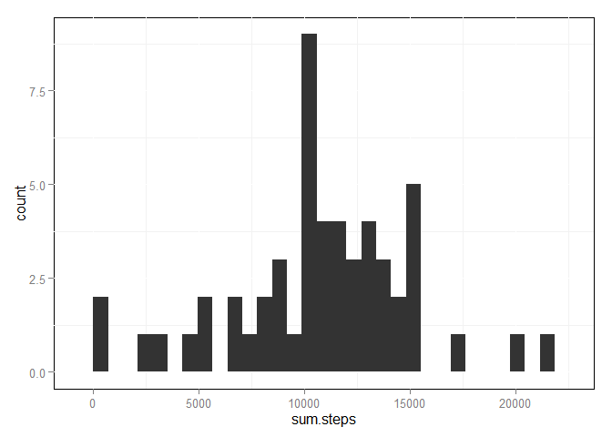
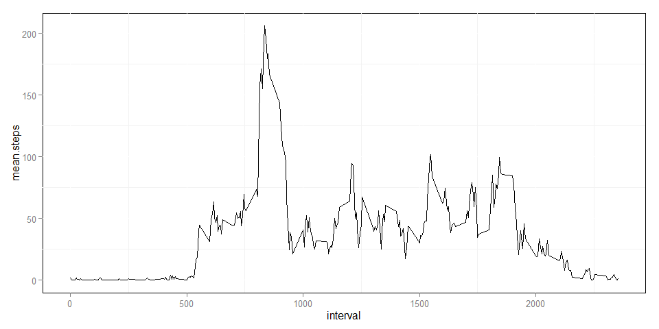
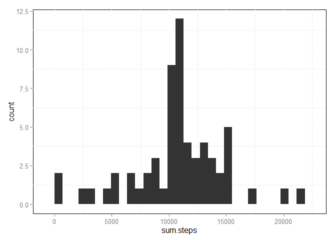
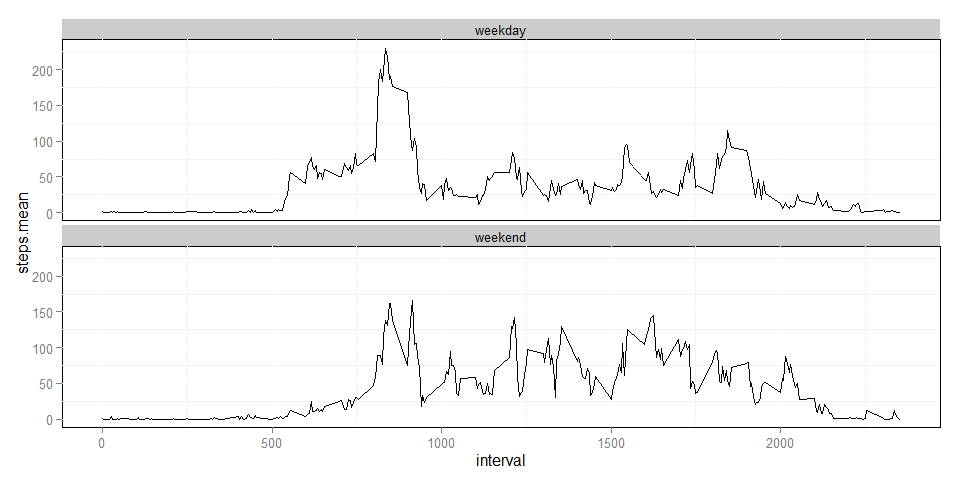

# Reproducible Research: Peer Assessment 1
## Loading and preprocessing the data

__*Show any code that is needed to*__

__*Load the data (i.e. read.csv())*__


```r
# Location of the data
data.dir="activity"

#  data file
data.filename= "activity.csv"

# path to data
data.path= paste(data.dir,data.filename,sep='/')

# read the data
data.raw <- read.csv(data.path)
```

All the data is stored in the variable `data.raw`.  

A quick inspection


```r
names(data.raw)
```

```
## [1] "steps"    "date"     "interval"
```

```r
str(data.raw)
```

```
## 'data.frame':	17568 obs. of  3 variables:
##  $ steps   : int  NA NA NA NA NA NA NA NA NA NA ...
##  $ date    : Factor w/ 61 levels "2012-10-01","2012-10-02",..: 1 1 1 1 1 1 1 1 1 1 ...
##  $ interval: int  0 5 10 15 20 25 30 35 40 45 ...
```


__*Process/transform the data (if necessary) into a format suitable for your analysis*__

Load libraries required for the analysis


```r
# libraries required
library(ggplot2, warn.conflicts = FALSE, quietly=TRUE)
library(dplyr, warn.conflicts = FALSE, quietly=TRUE)
library(chron, warn.conflicts = FALSE, quietly=TRUE)
# option on how to represent numbers
options(scipen=999)
```

Create a version of the data that does not contain any NA


```r
# ignore the missing values
data.no_na <- na.omit(data.raw)
```

## *What is mean total number of steps taken per day?*

__*For this part of the assignment, you can ignore the missing values in the dataset.*__

__*1. Calculate the total number of steps taken per day*__


```r
# extract the number of steps per day
data.sum.day_steps <- summarise(group_by(data.no_na, date), 
                                sum.steps=sum(steps))
```


__*2. Make a histogram of the total number of steps taken each day*__


```r
qplot(sum.steps,data=data.sum.day_steps,
      geom="histogram")+
  # fix labels position
  theme(panel.background = element_rect(fill = 'white', colour = 'black'))
```

```
## stat_bin: binwidth defaulted to range/30. Use 'binwidth = x' to adjust this.
```

 


__*3. Calculate and report the mean and median of the total number of steps taken per day*__


```r
# compute the mean
data.mean_day_steps <- mean(data.sum.day_steps$sum.steps)

# compute the median
data.median_day_steps <- median(data.sum.day_steps$sum.steps)
```

 - the mean daily number of steps is 10766.1886792
 - the median daily number of steps is 10765
 

## What is the average daily activity pattern?

__*1. Make a time series plot (i.e. `type = "l"`) of the 5-minute interval (x-axis) and the average number of steps taken, averaged across all days (y-axis)*__


```r
# compute the average number of steps taken, averaged across all days
# based on the 5-minute interval 
data.no_na.mean_interval_steps <- summarise(group_by(data.no_na,
                                                     interval), 
                                            mean.steps= mean(steps))
# plot the the 5-minute interval (x-axis) and the average number of steps taken, averaged across all days (y-axis)

qplot(interval, mean.steps, data=data.no_na.mean_interval_steps,geom="line")+
  theme(panel.background = element_rect(fill = 'white', colour = 'black'))
```

 

__*2. Which 5-minute interval, on average across all the days in the dataset, contains the maximum number of steps?*__


```r
# sort the  list 
sort.mean.interval.steps <- arrange(data.no_na.mean_interval_steps,
                                    desc(mean.steps))
# extract the first time  instant
instant= sort.mean.interval.steps[1,1]

# get the max number of steps
max_steps=  sort.mean.interval.steps[1,2]
```

The 5-minute interval, on average across all the days in the dataset, that contains the maximum number of steps is 835 with 206.1698113.


## Imputing missing values

__*Note that there are a number of days/intervals where there are missing values (coded as NA). The presence of missing days may introduce bias into some calculations or summaries of the data.*__

__*1. Calculate and report the total number of missing values in the dataset (i.e. the total number of rows with NAs)*__


```r
# calculate the number of missing values
dimNA <- dim(data.raw) - dim(data.no_na)
# report the value
dimNA[1]
```

```
## [1] 2304
```

The number of total 'NA' is 2304

__*2. Devise a strategy for filling in all of the missing values in the dataset. The strategy does not need to be sophisticated. For example, you could use the mean/median for that day, or the mean for that 5-minute interval, etc.*__

I address the question by replacing the missing values with the mean value of the same interval across all days


```r
# this function replaces the NAs with the estimates
# if the steps is NA, replace it the instant mean
# otherwise keep the value

estimate_na_steps <- function(data_row) {
  steps= data_row[[1]]
  intervals= as.numeric(data_row[[3]])
  # check whether the value of steps is NA
  if (is.na(steps)) {
    # replace it the instant mean
    f= filter(data.no_na.mean_interval_steps,interval==intervals)
    steps=f[[which(colnames(f)=="mean.steps")]]
  } # implicit else:  keep steps the way it is
  # return the original steps, or its estimate
  steps
}
```
 

__*3. Create a new dataset that is equal to the original dataset but with the missing data filled in.*__


```r
# apply the function to the raw data read from the file
#data.estimated <- transform(data.raw,steps=na.fill(steps,interval))

data.estimated <- data.frame(steps= as.numeric(apply(data.raw,1,estimate_na_steps)),
                             date= data.raw$date,
                             interval= data.raw$interval)
```

The data with the estimates is stored in `data.estimated`.

Verify that the transformation worked correctly


```r
# the dimention of data.estimate is the same of data.raw
dim(data.estimated)==dim(data.raw)
```

```
## [1] TRUE TRUE
```

```r
# data.estimate has no NA
sum(is.na(data.estimated))==0
```

```
## [1] TRUE
```


__*4. Make a histogram of the total number of steps taken each day and Calculate and report the mean and median total number of steps taken per day. Do these values differ from the estimates from the first part of the assignment? What is the impact of imputing missing data on the estimates of the total daily number of steps?*__


```r
# extract the estimated number of steps per day
est.data.sum.day_steps <- summarise(group_by(data.estimated, date), 
                                    sum.steps=sum(steps))

# compute the mean in the estimated case
est.mean_day_steps <- mean(est.data.sum.day_steps$sum.steps)

# compute the median in the estimated case
est.median_day_steps <- median(est.data.sum.day_steps$sum.steps)

# plot histogram
histogram= qplot(sum.steps,
                 data=est.data.sum.day_steps,
                 geom="histogram")+  
  theme(panel.background = element_rect(fill = 'white', colour = 'black'))
# add the median (and the mean that has basically the same value)
histogram= histogram + geom_abline(intercept = est.median_day_steps, slope = 0,
                                   color= "lightblue")
#display
histogram
```

```
## stat_bin: binwidth defaulted to range/30. Use 'binwidth = x' to adjust this.
```

 

The histogram above shows shows the estimated number of steps per day, while the light blue line shows the value  of the median (and the mean) daily number of steps.

The requested mean and median values are below.

 - the mean daily number of steps is 10766.1886792
 - the median daily number of steps is 10766.1886792


__*Impact of imputing missing data on the estimates of the total daily number of steps*__

`est.mean_day_steps - data.mean_day_steps` = 0 

and

`est.median_day_steps - data.median_day_steps` = 1.1886792

The means and median do not differ.  Although this is somewhat surprising, in reality it is not because the missing values all concentrated in 8 days (2012-10-01 2012-10-08 2012-11-01 2012-11-04 2012-11-09 2012-11-10 2012-11-14
2012-11-30) and in these days all values are replaced with the corresponding mean values.  As a consequence it woudl be rather suprising to find a major chance on the means and the median. 

## Are there differences in activity patterns between weekdays and weekends?

__*For this part the weekdays() function may be of some help here. Use the dataset with the filled-in missing values for this part.*__

__*1. Create a new factor variable in the dataset with two levels - "weekday" and "weekend" indicating whether a given date is a weekday or weekend day.*__


```r
# define constant labels for week end and week 
weekend.level <- "weekend"
weekday.level <- "weekday"

# distinguish week ends from week days.
data.estimated.we_wd <- mutate(data.estimated,
                               we_wd=ifelse(is.weekend(as.Date(date)),
                                            weekend.level,
                                            weekday.level))
# transform the we_wd variable in a factor
# (strickly speakinng it is not needed, but it seems to be required by the homework)
data.estimated.we_wd$we_wd <- as.factor(data.estimated.we_wd$we_wd)
```


__*2. Make a panel plot containing a time series plot (i.e. type = "l") of the 5-minute interval (x-axis) and the average number of steps taken, averaged across all weekday days or weekend days (y-axis).*__


```r
# compute the mean steps distinguishing week days and week ends
mean.interval.steps <- summarise(group_by(data.estimated.we_wd, 
                                          interval, 
                                          we_wd),
                                 steps.mean = mean(steps))

# make two plots

plot.final <- ggplot(mean.interval.steps,aes(interval,steps.mean))+
  #using line geometry as required
  geom_line()+
  # faceting on weekend/weekday
  facet_wrap(~we_wd,ncol=1)+
  theme(panel.background = element_rect(fill = 'white', colour = 'black'))

# plot the graph
plot.final 
```

 

